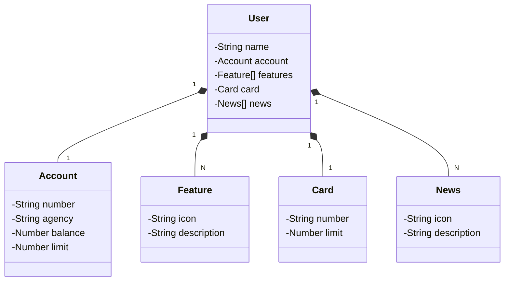

# Santander-Dev-Week-2023

API Replica Desenvolvida em curso e replicada no Github para pr√°tica e estudos! 
Java RESTful criada para a Santander Dev Week (Lab Replicado)

# Diagrama de Classes:

```mermaid
classDiagram
  class User {
    -String name
    -Account account
    -Feature[] features
    -Card card
    -News[] news
  }

  class Account {
    -String number
    -String agency
    -Number balance
    -Number limit
  }

  class Feature {
    -String icon
    -String description
  }

  class Card {
    -String number
    -Number limit
  }

  class News {
    -String icon
    -String description
  }

  User "1" *-- "1" Account
  User "1" *-- "N" Feature
  User "1" *-- "1" Card
  User "1" *-- "N" News
```
